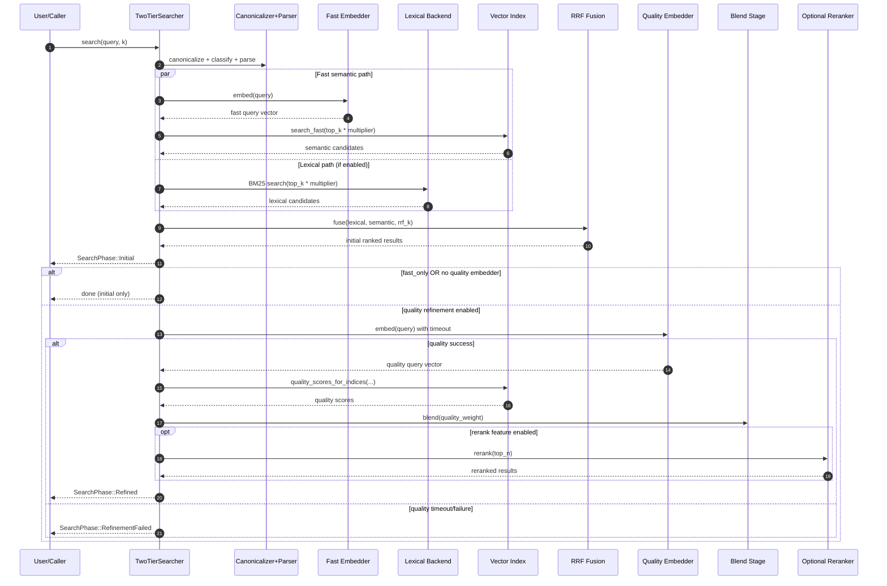

# frankensearch

[](https://github.com/Dicklesworthstone/frankensearch/actions/workflows/ci.yml)
[](https://crates.io/crates/frankensearch)
[](https://opensource.org/licenses/MIT)

Two-tier hybrid local search for Rust and the `fsfs` standalone CLI: fast first-pass results, then quality refinement.

## Install In One Line

```bash
curl -fsSL https://raw.githubusercontent.com/Dicklesworthstone/frankensearch/main/install.sh | bash -s -- --easy-mode
```

Installer goals:
- zero-friction first run
- auto-configured model cache path
- sane defaults for interactive usage

## Cargo Install (Developer Path)

`fsfs` currently builds from this workspace and uses the pinned nightly toolchain (`rust-toolchain.toml`):

```bash
cargo +nightly install --path crates/frankensearch-fsfs
fsfs version
fsfs status --no-watch-mode --format json
```

## Quick Start (60 Seconds)

```bash
# 1) Install
curl -fsSL https://raw.githubusercontent.com/Dicklesworthstone/frankensearch/main/install.sh | bash -s -- --easy-mode

# 2) Index a directory
fsfs index ./my-project

# 3) Search
fsfs search "how does retry backoff work" --limit 5
```

Example output:

```text
PHASE 0 (fast): 5 hits in 12ms
  1. src/retry.rs      score=0.812
  2. docs/failures.md  score=0.774

PHASE 1 (refined): 5 hits in 151ms
  1. src/retry.rs      score=0.923
  2. src/http/client.rs score=0.901
```

## What It Does

`frankensearch` combines lexical and semantic retrieval with progressive delivery:
- lexical BM25 via Tantivy for exact keyword precision
- fast semantic tier for immediate relevant hits
- quality semantic tier for reranked refinement
- reciprocal rank fusion (RRF) to combine sources robustly

Result: responsive first answers plus better final ranking without blocking the UI.

## Core Features

- Auto-download and model fallback chain (`fastembed`/`model2vec`/`hash`)
- Progressive search phases (`Initial`, `Refined`, `RefinementFailed`)
- Agent-friendly streaming (`--stream`) with machine-readable output
- Result explanation surfaces (`fsfs explain <result-id>`)
- Multiple output formats: `table`, `json`, `jsonl`, `toon`, `csv`
- Watch/incremental indexing mode for local corpus updates
- Portable SIMD vector search + quantized FSVI storage
- Optional reranking and ANN paths via feature flags

## CLI At A Glance

```bash
# Basic search
fsfs search "structured concurrency" --limit 10

# Stream for agents/pipelines
fsfs search "query" --stream --format jsonl

# TOON mode
fsfs search "query" --stream --format toon

# Explain one result
fsfs explain result-123

# Keep index fresh
fsfs index ~/projects --watch

# Health checks
fsfs doctor
```

## Reproducible Showcase Suite

Use this sequence to reproduce the core demo + benchmark evidence bundle:

```bash
# Progressive CLI behavior and machine-output surfaces
fsfs search "structured concurrency" --limit 10 --format table
fsfs search "structured concurrency" --limit 10 --stream --format jsonl

# Statistical benchmark regression lane (Tier-3 reproducibility anchor)
cargo test -p frankensearch-fsfs --test benchmark_baseline_matrix -- --nocapture

# Graceful-degradation/fault demonstration lane
cargo test -p frankensearch-fsfs --test pressure_simulation_harness \
  scenario_long_run_soak_fault_injection_stays_within_drift_thresholds -- --nocapture
```

The benchmark lane validates deterministic artifact identity fields (`dataset_sha256`, `matrix_sha256`, `samples_sha256`) plus a fixed replay command contract.

## Configuration

Configuration precedence:
1. CLI flags
2. project config file
3. user config file
4. environment variables
5. built-in defaults

Common environment variables:

| Variable | Purpose | Example |
|---|---|---|
| `FRANKENSEARCH_MODEL_DIR` | Override model location | `~/.cache/frankensearch/models` |
| `FRANKENSEARCH_FAST_ONLY` | Skip quality refinement | `true` |
| `FRANKENSEARCH_QUALITY_WEIGHT` | Blend quality vs fast tier | `0.7` |
| `FRANKENSEARCH_RRF_K` | RRF constant | `60` |
| `FRANKENSEARCH_LOG` | Tracing filter | `info` |

For full contracts and knobs:
- `docs/fsfs-config-contract.md`
- `docs/fsfs-dual-mode-contract.md`
- `docs/fsfs-packaging-release-install-contract.md`
- `docs/fsfs-packaging-release-install-contract.md#host-migration-playbooks-priority-projects`
- `docs/fsfs-packaging-release-install-contract.md#staged-rollout-and-deterministic-fallback-protocol`
- `docs/fsfs-packaging-release-install-contract.md#upgrade-and-migration-compatibility-verification-strategy`
- `docs/architecture/`

## How It Works

Pipeline summary:

```text
Query
  -> canonicalize
  -> classify
  -> fast embed + lexical BM25
  -> RRF fusion (initial)
  -> quality embed (top candidates)
  -> blend (and optional rerank)
  -> refined results
```

Model path used in the default quality lane:
- fast tier: potion-128M (or fallback)
- fusion: RRF over lexical + semantic ranks
- quality tier: MiniLM
- optional final rerank: FlashRank cross-encoder

## Architecture Breakdown

`frankensearch` is split into focused crates so each concern can evolve independently:

| Crate | Responsibility |
|---|---|
| `frankensearch-core` | Shared types/traits/errors/config, query canonicalization/classification, metrics/eval helpers |
| `frankensearch-embed` | Embedding backends and fallback stack (`hash`, `model2vec`, `fastembed`) |
| `frankensearch-index` | FSVI vector storage, SIMD dot products, top-k search, optional ANN support |
| `frankensearch-lexical` | Tantivy schema/index/search for BM25 lexical retrieval |
| `frankensearch-fusion` | RRF fusion, two-tier orchestration, blending, optional rerank integration |
| `frankensearch-rerank` | Cross-encoder reranking integration |
| `crates/frankensearch-fsfs` | Standalone CLI product around the library stack |

This separation gives you two options:
- use the top-level library as a drop-in engine in your own app
- run the full standalone `fsfs` binary with progressive CLI/TUI workflows

## Query Lifecycle (Detailed)

At execution time, the system follows this shape:

1. Canonicalize and parse the query
- Normalize text, strip noise, preserve user intent.
- Classify query type (`identifier`, `short keyword`, `natural language`) for adaptive budgets.

2. Run Phase 1 retrieval
- Generate fast embedding (or fallback).
- Run lexical BM25 search (if configured).
- Run vector top-k on the fast index.
- Fuse lexical + semantic candidates with RRF.
- Emit `Initial` results quickly.

3. Run Phase 2 refinement (unless `fast_only`)
- Generate quality embedding.
- Re-score or refine top candidates with quality tier.
- Blend fast and quality semantic scores.
- Optionally rerank with cross-encoder.
- Emit `Refined` or `RefinementFailed` (graceful degradation path).

## Algorithms Used

### 1. Reciprocal Rank Fusion (RRF)

RRF is rank-based and model-agnostic. It does not require score calibration across systems:

```text
RRF(doc) = Σ_sources 1 / (K + rank(doc, source) + 1)
```

Default `K` is `60` (configurable with `FRANKENSEARCH_RRF_K` / `rrf_k`).

Why RRF:
- robust to score-scale mismatch between BM25 and vector similarity
- simple, stable, and strong in practice
- rewards documents that appear in multiple retrieval channels

### 2. Two-Tier Score Blending

During refinement, fast and quality semantic scores are normalized then blended:

```text
blended_score = alpha * quality_score + (1 - alpha) * fast_score
```

`alpha` is controlled by `quality_weight` (default target `0.7`).

### 3. Deterministic Ordering

When ties happen, ranking remains deterministic through stable tie-break logic
(including lexical comparison and `doc_id` ordering), which helps replayability
and makes diff-based evaluation much cleaner.

## Index Format and Retrieval Internals

### FSVI Storage

Vector data is stored in FSVI files with memory-mapped access:
- primary default quantization: `f16` (good memory/quality tradeoff)
- optional `f32` paths where needed
- explicit metadata and format checks to catch corruption early

Why this matters:
- lower memory footprint than full `f32` storage in common workloads
- fast startup and read paths via mmap
- predictable, portable on-disk format for local search use

### Vector Top-K Implementation

The brute-force search path is optimized around:
- SIMD dot products
- bounded heap selection for top-k
- NaN-safe total ordering
- two-phase work: score first, materialize doc ids for winners

This gives strong baseline behavior while ANN remains optional for larger corpora.

## Runtime and Concurrency Model

The async model uses `asupersync` and capability context (`Cx`), not Tokio.

Important implications:
- host-controlled runtime ownership: your app provides runtime/cancellation context
- cancellation-aware search phases and timeouts
- no hard Tokio coupling in public contracts

This is useful if you need to embed search inside existing non-Tokio runtimes or
strictly controlled execution environments.

## Design Principles

Core engineering principles in this project:

- Progressive delivery first
- Fast initial answer, then quality refinement, instead of blocking on best possible ranking.

- Graceful degradation
- If quality tier/reranker/model loading fails, search still returns useful initial results.

- Determinism and reproducibility
- Stable ordering and artifact-driven evaluation support regression tracking and CI gates.

- Explicit tradeoffs over hidden magic
- Key knobs (`rrf_k`, blend weight, fast-only mode, candidate multipliers) are visible and tunable.

- Practical hybrid retrieval
- BM25 and embeddings are treated as complementary signals, not mutually exclusive choices.

## Why This Is Useful

`frankensearch` is especially strong when you need:
- intent-level recall beyond exact grep matching
- low-latency first results for interactive workflows
- local-first operation with optional model download only
- agent-friendly output contracts (`jsonl`, `toon`) and explainability hooks
- one reusable engine across multiple products instead of bespoke search stacks

In short: it closes the gap between exact text lookup and semantic retrieval
without forcing you into remote services or heavyweight distributed systems.

## Tuning Playbook

Common tuning patterns:

- Need lower tail latency:
  - enable `FRANKENSEARCH_FAST_ONLY=true`
  - reduce candidate budget and rerank depth
  - keep lexical enabled for exact-match recovery

- Need higher relevance quality:
  - keep quality tier enabled
  - increase candidate multiplier
  - enable reranking for top-N only

- Need memory efficiency:
  - stay on f16 index quantization
  - use ANN selectively above practical corpus thresholds

- Need operational clarity:
  - emit JSONL/TOON for automation
  - monitor phase timings and drift through test harness artifacts

## Quality and Evaluation Discipline

The repository includes explicit quality harnesses and statistical checks:
- IR metrics: `nDCG@K`, `MRR`, `Recall@K`, plus bootstrap confidence intervals
- profile comparisons with deterministic manifests
- benchmark/e2e artifact contracts for repeatable regression analysis

This keeps tuning decisions evidence-driven rather than anecdotal.

## Limits and Tradeoffs

Being explicit about scope helps set expectations:
- Hybrid search is more complex than plain `rg` and has model/runtime overhead.
- Quality-tier refinement improves ranking but increases latency.
- ANN helps at larger scale but adds index lifecycle complexity.
- Semantic quality depends on corpus characteristics and embedding model fit.

Use `rg`/`grep` for strict exact matching and `frankensearch` when ranking by
intent and contextual relevance matters.

## Library Integration Quickstart (Rust)

If you want to embed `frankensearch` directly in your Rust app, this is the
minimum end-to-end flow:

```rust,ignore
use std::sync::Arc;

use frankensearch::{
    Embedder, EmbedderStack, HashEmbedder, IndexBuilder, TwoTierConfig, TwoTierIndex,
    TwoTierSearcher,
};

asupersync::test_utils::run_test_with_cx(|cx| async move {
    // 1) Choose embedders (hash embedders shown for zero-dependency quickstart)
    let fast = Arc::new(HashEmbedder::default_256()) as Arc<dyn Embedder>;
    let quality = Arc::new(HashEmbedder::default_384()) as Arc<dyn Embedder>;
    let stack = EmbedderStack::from_parts(fast, Some(quality));

    // 2) Build an index from documents
    IndexBuilder::new("./my_index")
        .with_embedder_stack(stack)
        .add_document("doc-1", "Rust ownership and borrowing")
        .add_document("doc-2", "Structured concurrency with asupersync")
        .build(&cx)
        .await
        .expect("index build should succeed");

    // 3) Open and search
    let index = Arc::new(TwoTierIndex::open("./my_index", TwoTierConfig::default()).unwrap());
    let searcher = TwoTierSearcher::new(
        index,
        Arc::new(HashEmbedder::default_256()) as Arc<dyn Embedder>,
        TwoTierConfig::default(),
    );

    let (results, metrics) = searcher
        .search_collect(&cx, "ownership rules", 10)
        .await
        .expect("search should succeed");

    println!("results={} phase1_ms={:.2}", results.len(), metrics.phase1_total_ms);
});
```

Notes:
- For production semantic quality, use `model2vec` + `fastembed` (or `EmbedderStack::auto_detect_with`).
- Use `search_collect_with_text` or full `search(...)` when you need negation filtering (`-term`) and rerank text access.
- Keep `TwoTierConfig` explicit in code for reproducible behavior across environments.

## Baseline Performance Envelope (Reference)

These are practical CPU-only reference numbers for a healthy local setup.
Treat them as orientation targets, not hard SLAs:

| Operation | Typical Envelope |
|---|---|
| Fast hash embedding | ~11 μs |
| Fast model embedding (potion-128M) | ~0.57 ms |
| Quality model embedding (MiniLM) | ~128 ms |
| Vector search (10K docs, top-10) | ~2 ms |
| RRF fusion (500 + 500 candidates) | ~1 ms |
| Phase 1 initial delivery | usually `< 15 ms` target |
| Phase 2 refined delivery | usually `~150 ms` target |

What changes the envelope the most:
- query class and candidate budget
- corpus size and document length distribution
- enabled features (`lexical`, `rerank`, `ann`)
- model tier selection and cache state

## Failure Modes and Degradation Behavior

The engine is intentionally designed to degrade gracefully:

| Condition | Behavior | What Caller Sees |
|---|---|---|
| Quality refinement timeout | Phase 2 aborts safely | `SearchPhase::RefinementFailed { error: SearchTimeout, ... }` |
| Quality embedder errors | Initial results preserved | `SearchPhase::RefinementFailed { ... }` |
| `fast_only=true` | Skip quality phase by design | only `Initial` phase + `skip_reason="fast_only"` |
| No quality embedder configured | Skip quality phase | only `Initial` phase + `skip_reason="no_quality_embedder"` |
| Fast embedder fails but lexical succeeds | lexical-only fallback | valid `Initial` results from lexical path |
| Fast embedder fails and no lexical fallback | hard failure | search returns error |
| Lexical backend failure | semantic continues | search continues without lexical contribution |

Practical implication: phase-1 UX can still stay responsive even when higher-cost
quality paths fail.

## Production Deployment Checklist

Use this as a pragmatic hardening pass before rollout:

1. Pin explicit feature set (`semantic`, `hybrid`, `full`, etc.) and toolchain.
2. Decide runtime mode per environment (`fast_only` in latency-critical paths, full two-tier where quality matters).
3. Set `FRANKENSEARCH_MODEL_DIR` to a stable writable path with enough disk.
4. Enable structured logs/metrics (`FRANKENSEARCH_LOG`) and capture phase timings.
5. Run quality gates:
   - `cargo fmt --check`
   - `cargo check --workspace --all-targets`
   - `cargo clippy --workspace --all-targets -- -D warnings`
   - `cargo test --workspace`
6. Run benchmark and quality harnesses on representative corpora before release.
7. Validate degradation behavior by intentionally forcing quality timeout/failure.
8. For large corpora, evaluate ANN thresholding and memory budget explicitly.
9. Keep reproducible artifacts for before/after tuning comparisons.

## Troubleshooting by Symptom

| Symptom | Likely Cause | What To Check |
|---|---|---|
| Initial results are slow | Candidate budget too high, cold cache, oversized corpus | candidate multipliers, model cache warm-up, corpus and index size |
| No refined phase arrives | `fast_only` enabled, no quality embedder, timeout | `FRANKENSEARCH_FAST_ONLY`, quality model availability, `quality_timeout_ms` |
| `RefinementFailed` appears often | quality model unstable/slow, timeout budget too tight | model path/logs, timeout config, CPU contention |
| Results feel exact-match heavy | lexical overweight via candidate mix, weak semantic model tier | embedder stack selection, query class budgets, quality tier availability |
| Results feel semantically off | embedding model mismatch for corpus domain | switch model tier, tune blend weight, add rerank |
| Negation queries (`-term`) behave unexpectedly | missing text provider in convenience path | use `search_collect_with_text`/`search(...)` with text callback |
| Output parsing issues in automation | wrong format for downstream parser | use `--format jsonl` or `--format toon` consistently |
| High memory usage | large index + quality/rerank/ANN enabled | feature set, f16 defaults, ANN config, corpus scope |

## Sequence Diagram (Mermaid)



## Feature-Flag Decision Table

These are crate feature flags from `frankensearch/Cargo.toml`:

| Goal | Recommended Feature Set | Why |
|---|---|---|
| Fastest dev loop / CI smoke checks | `default` (`hash`) | zero model downloads, minimal deps |
| Better semantic quality without lexical | `semantic` | enables `hash + model2vec + fastembed` |
| Hybrid retrieval (semantic + BM25) | `hybrid` | adds lexical precision on top of semantic recall |
| Persistent local indexing | `persistent` | `hybrid + storage` for durable metadata/queues |
| Durable + self-healing stack | `durable` | `persistent + durability` |
| Full capability surface | `full` | `durable + rerank + ann + download` |
| Full stack + FTS5 storage backend | `full-fts5` | `full + fts5` for advanced local SQL FTS paths |

Quick examples:

```bash
# Hybrid local search library build
cargo build -p frankensearch --features hybrid

# Full stack with ANN + rerank + download
cargo build -p frankensearch --features full

# Full stack plus FTS5
cargo build -p frankensearch --features full-fts5
```

## Config Recipes

### 1) Latency-First Profile

Best for interactive UX where fast first answer matters most.

```bash
export FRANKENSEARCH_FAST_ONLY=true
export FRANKENSEARCH_QUALITY_WEIGHT=0.7
export FRANKENSEARCH_RRF_K=60
export FRANKENSEARCH_QUALITY_TIMEOUT=250
```

Operational effect:
- returns `Initial` quickly and skips/limits expensive refinement behavior
- predictable low-latency tail for chat/assistant loops

### 2) Quality-First Profile

Best for offline analysis, report generation, or high-precision ranking.

```bash
export FRANKENSEARCH_FAST_ONLY=false
export FRANKENSEARCH_QUALITY_WEIGHT=0.85
export FRANKENSEARCH_RRF_K=40
export FRANKENSEARCH_QUALITY_TIMEOUT=1200
```

Operational effect:
- gives quality tier and rerank more room to improve ordering
- increases median and tail latency

### 3) Memory/CPU-Conservative Profile

Best for constrained laptops or multi-tenant CI hosts.

```bash
export FRANKENSEARCH_FAST_ONLY=true
export FRANKENSEARCH_QUALITY_TIMEOUT=200
export FRANKENSEARCH_HNSW_THRESHOLD=200000
```

Operational effect:
- reduces expensive quality-phase work
- avoids ANN build/search overhead for smaller corpora

### Optional: `TwoTierConfig::optimized()` TOML Recipe

For library consumers using `TwoTierConfig::optimized()`, place a file at
`data/optimized_params.toml`:

```toml
quality_weight = 0.8
rrf_k = 50.0
candidate_multiplier = 4
quality_timeout_ms = 800
fast_only = false
explain = false
hnsw_ef_search = 100
hnsw_ef_construction = 200
hnsw_m = 16
hnsw_threshold = 50000
mrl_search_dims = 0
mrl_rescore_top_k = 30
```

Use this when you want deterministic, checked-in tuning presets instead of
host-specific env var drift.

## Reference Appendix

### Key Source Files

| Area | Source File | Purpose |
|---|---|---|
| Facade crate | [`frankensearch/src/lib.rs`](frankensearch/src/lib.rs) | Top-level public API surface and re-exports |
| Index build workflow | [`frankensearch/src/index_builder.rs`](frankensearch/src/index_builder.rs) | High-level corpus-to-index pipeline |
| Progressive orchestration | [`crates/frankensearch-fusion/src/searcher.rs`](crates/frankensearch-fusion/src/searcher.rs) | Phase 1/2 flow, fallback paths, telemetry |
| Rank fusion | [`crates/frankensearch-fusion/src/rrf.rs`](crates/frankensearch-fusion/src/rrf.rs) | Reciprocal Rank Fusion implementation |
| Two-tier blending | [`crates/frankensearch-fusion/src/blend.rs`](crates/frankensearch-fusion/src/blend.rs) | Fast/quality score normalization and blending |
| Two-tier index wrapper | [`crates/frankensearch-index/src/two_tier.rs`](crates/frankensearch-index/src/two_tier.rs) | Fast/quality index alignment and lookup |
| Top-k vector search | [`crates/frankensearch-index/src/search.rs`](crates/frankensearch-index/src/search.rs) | Heap-based top-k selection and scoring paths |
| On-disk vector format | [`crates/frankensearch-index/src/fsvi.rs`](crates/frankensearch-index/src/fsvi.rs) | FSVI format, quantization, mmap reads |
| Core config knobs | [`crates/frankensearch-core/src/config.rs`](crates/frankensearch-core/src/config.rs) | `TwoTierConfig`, defaults, env overrides |
| Core result types | [`crates/frankensearch-core/src/types.rs`](crates/frankensearch-core/src/types.rs) | `SearchPhase`, `ScoredResult`, hit structs |
| Query classification | [`crates/frankensearch-core/src/query_class.rs`](crates/frankensearch-core/src/query_class.rs) | Query-type detection and adaptive budgets |
| Eval/statistics | [`crates/frankensearch-core/src/metrics_eval.rs`](crates/frankensearch-core/src/metrics_eval.rs) | nDCG/MRR/Recall/MAP + bootstrap helpers |
| Embedder auto-detect | [`crates/frankensearch-embed/src/auto_detect.rs`](crates/frankensearch-embed/src/auto_detect.rs) | Fast/quality model discovery and stack setup |
| FSFS CLI entry | [`crates/frankensearch-fsfs/src/lib.rs`](crates/frankensearch-fsfs/src/lib.rs) | Standalone CLI product wiring |

### Glossary

| Term | Meaning |
|---|---|
| Two-tier search | Progressive retrieval: fast initial pass, quality refinement pass |
| Phase 1 / `Initial` | First emitted result set, optimized for low latency |
| Phase 2 / `Refined` | Optional improved ranking after quality embedding |
| `RefinementFailed` | Graceful degradation event when Phase 2 errors/times out |
| RRF | Reciprocal Rank Fusion combining lexical + semantic rank lists |
| BM25 | Lexical ranking function used by Tantivy backend |
| FSVI | On-disk vector index format used by frankensearch-index |
| `f16` quantization | Half-precision storage mode reducing memory footprint |
| `TwoTierIndex` | Wrapper over fast and optional quality vector indexes |
| `TwoTierSearcher` | Main orchestrator that runs retrieval/fusion/refinement |
| `TwoTierConfig` | Primary tuning config for latency/quality behavior |
| `TwoTierMetrics` | Per-search diagnostics (phase timings, candidate counts, skip reason) |
| `EmbedderStack` | Paired fast + optional quality embedder selection object |
| `Cx` | asupersync capability context passed into async operations |

### Knob Impact Matrix

| Knob | Where Set | Primary Impact | Increase Tends To | Decrease Tends To |
|---|---|---|---|---|
| `quality_weight` | `TwoTierConfig`, `FRANKENSEARCH_QUALITY_WEIGHT` | Blend balance | Favor quality-tier ranking signal | Favor fast-tier ranking signal |
| `rrf_k` | `TwoTierConfig`, `FRANKENSEARCH_RRF_K` | RRF rank sensitivity | Flatten rank differences across sources | Emphasize top ranks more strongly |
| `candidate_multiplier` | `TwoTierConfig` | Candidate pool size | Improve recall headroom, increase latency/work | Reduce latency/work, may reduce recall |
| `quality_timeout_ms` | `TwoTierConfig`, `FRANKENSEARCH_QUALITY_TIMEOUT` | Phase 2 budget | More chances to finish refinement | More `RefinementFailed` timeouts |
| `fast_only` | `TwoTierConfig`, `FRANKENSEARCH_FAST_ONLY` | Phase behavior | Skip Phase 2 entirely (`true`) | Enable Phase 2 when quality embedder exists (`false`) |
| `hnsw_threshold` | `TwoTierConfig`, `FRANKENSEARCH_HNSW_THRESHOLD` | ANN activation point | Use brute-force for more corpus sizes | Use ANN earlier for large corpora |
| `hnsw_ef_search` | `TwoTierConfig` | ANN query beam width | Better ANN recall, more latency | Lower latency, potentially lower recall |
| `mrl_search_dims` | `TwoTierConfig` | MRL scan dimensionality | Better first-pass quality, more compute | Faster first-pass, potentially less quality |
| `mrl_rescore_top_k` | `TwoTierConfig` | Full-dim rescore scope | Better refined ordering, more compute | Less compute, potentially weaker refinement |
| `lexical` feature | Cargo feature | Hybrid retrieval capability | Better exact-match precision and fallback paths | Semantic-only behavior |
| `rerank` feature | Cargo feature | Cross-encoder rerank | Better top-result precision, higher latency | Lower latency, less fine-grained top ordering |
| `ann` feature | Cargo feature | Approximate nearest-neighbor path | Better scale behavior at large corpus sizes | Simpler exact brute-force behavior |

## Why Not Just grep/ripgrep/ctags?

`grep`/`ripgrep`/`ctags` are excellent for exact text and symbol lookup. `frankensearch` solves a different problem: semantic intent search over mixed corpora.

| Tool | Strong At | Limitation vs frankensearch |
|---|---|---|
| `grep` | exact substrings | no semantic similarity |
| `ripgrep` | very fast regex search | no embedding-based recall |
| `ctags` | symbol navigation | not document-level semantic ranking |
| `frankensearch/fsfs` | hybrid semantic + lexical, progressive refinement | higher complexity/runtime footprint |

Use both: keep `rg` for exact matches and use `fsfs` for intent-level retrieval.

## FAQ

### Does it run fully local?
Yes. Search/indexing runs on your machine. Network access is only needed when downloading models.

### Can I use only the library and skip `fsfs`?
Yes. Add `frankensearch` as a dependency and wire your own app/runtime.

### What if the quality model is unavailable?
Search still works using fast-tier and lexical paths; you get `RefinementFailed` or fast-only behavior.

### Which output format should agents use?
Use `jsonl` for streaming automation and `toon` if your downstream stack expects TOON semantics.

### Is this tied to Tokio?
No. Async/concurrency is built around `asupersync` and `Cx`.

## Contributing

Project policy is no direct external merges, but issues and PRs are still useful for bug reports and proposal clarity.

If you are working inside this repository as an internal/automation agent:

```bash
cargo fmt --check
cargo check --workspace --all-targets
cargo clippy --workspace --all-targets -- -D warnings
cargo test --workspace
```

Useful docs:
- `AGENTS.md`
- `docs/e2e-artifact-contract.md`
- `docs/dependency-semantics-policy.md`

## License

MIT
