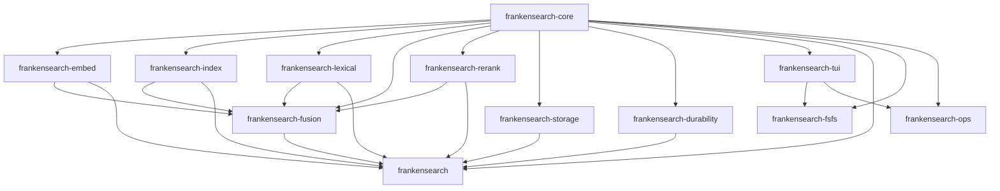
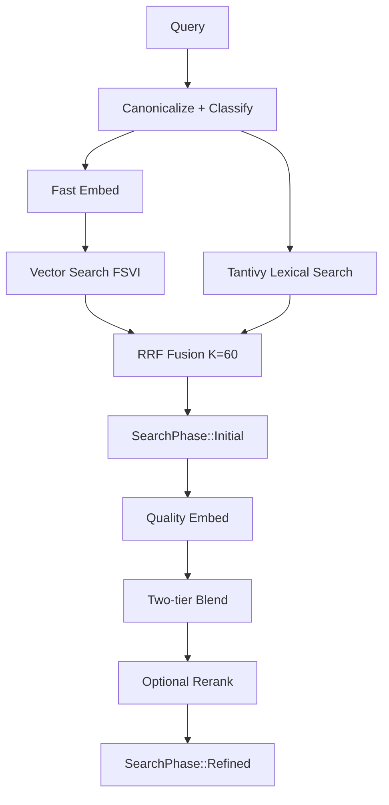

# frankensearch Architecture Overview

This document is the contributor-facing map of the current `frankensearch` workspace. It focuses on runtime behavior, crate boundaries, and the design choices that matter when you are changing code.

## 1) Workspace Crate Map (12 Crates)

| Crate | Purpose |
|---|---|
| `frankensearch-core` | Shared contracts: traits, errors, config, canonicalization, query classes, telemetry types |
| `frankensearch-embed` | Embedder implementations and model discovery/cache/download glue |
| `frankensearch-index` | FSVI vector format, search kernels (brute force + optional ANN), index builders |
| `frankensearch-lexical` | Tantivy-backed `LexicalSearch` implementation |
| `frankensearch-fusion` | RRF fusion, blending, progressive two-tier search orchestration |
| `frankensearch-rerank` | Optional cross-encoder reranking (FlashRank/ONNX) |
| `frankensearch-storage` | FrankenSQLite metadata, dedup/content-hash, persistent embedding queue |
| `frankensearch-durability` | Repair trailer and durability workflows, including Tantivy/FSVI helpers |
| `frankensearch-fsfs` | Standalone CLI/TUI search product (`fsfs`) built on library crates |
| `frankensearch-tui` | Shared TUI framework primitives (screens/shell/input/replay/theme) |
| `frankensearch-ops` | Fleet/operations console crate on top of `frankensearch-tui` |
| `frankensearch` | Facade crate that re-exports public APIs across the workspace |

High-level dependency arrows:

```text
frankensearch-core
  -> frankensearch-embed
  -> frankensearch-index
  -> frankensearch-lexical
  -> frankensearch-fusion
  -> frankensearch-rerank
  -> frankensearch-storage
  -> frankensearch-durability
  -> frankensearch-tui

frankensearch-fusion -> (embed, index, optional lexical/rerank)
frankensearch-fsfs   -> (core, tui)
frankensearch-ops    -> (core, tui)
frankensearch facade -> (core, embed, index, fusion, optional lexical/rerank/storage/durability)
```

Mermaid dependency view:



## 2) End-to-End Data Flow

### Indexing path

```text
document
  -> canonicalize (NFC/cleanup)
  -> embed (fast tier)
  -> persist vectors in FSVI
  -> persist metadata/queue state in FrankenSQLite
  -> optional lexical indexing via Tantivy
```

### Query path

```text
query
  -> parse + classify
  -> embed query (fast tier)
  -> search vector index (FSVI; optional ANN)
  -> search lexical index (Tantivy)
  -> RRF fuse
  -> emit initial results
  -> embed/refine with quality model
  -> blend scores
  -> optional cross-encoder rerank
  -> emit refined results
```

Mermaid search flow:



## 3) Two-Tier Strategy (Why It Exists)

The architecture intentionally separates speed and quality:

- Fast tier gets early, useful answers quickly (interactive latency budget).
- Quality tier spends more compute to improve ranking after initial display.

Practical effect:

- better perceived latency for users and agent workflows
- better final ranking than fast-only approaches
- graceful degradation when quality models are missing or fail

Progressive API contract:

- `SearchPhase::Initial`
- `SearchPhase::Refined`
- `SearchPhase::RefinementFailed`

This is implemented in the fusion/searcher lane and exposed to consumers through the facade and fsfs surfaces.

## 4) Storage Model

Three storage concerns are explicitly separated:

1. Vector storage: FSVI files (`frankensearch-index`)
2. Lexical storage: Tantivy index (`frankensearch-lexical`)
3. Metadata/job state: FrankenSQLite (`frankensearch-storage`)

Why split:

- each subsystem can optimize for its access pattern
- vector search remains SIMD/mmap focused
- metadata and queues stay transactional and durable
- lexical ranking keeps BM25 semantics and query parsing isolated

## 5) Durability Layer

`frankensearch-durability` adds corruption detection/repair primitives around persistent files, including:

- RaptorQ FEC sidecar materialization/validation for recoverability
- repair trailer I/O
- file/segment verification and repair orchestration
- durability metrics and health reporting

This layer is deliberately optional so lightweight deployments can skip its overhead, while higher-durability environments can enable it.

## 6) Async Runtime Model (asupersync, not tokio)

The workspace uses `asupersync` for async/concurrency contracts.

Operational implications:

- async functions receive a `Cx` capability context
- cancellation and scoped task lifetimes are part of normal control flow
- runtime behavior is explicit in API boundaries (especially embed/search/rerank paths)

Why it matters to contributors:

- do not add tokio/hyper/reqwest patterns
- preserve `Cx` plumbing in new async code
- keep cancellation-correct behavior when adding queues/workers/search phases

## 7) Key Design Decisions and Rationale

- f16 quantization for vector storage
  - reduces vector footprint materially while retaining ranking quality for cosine-style retrieval
- RRF with `K=60`
  - robust rank-based fusion across lexical and semantic lists without fragile score normalization coupling
- progressive iterator/phase model
  - enables fast-first UX with quality refinement as a second phase
- NaN-safe ordering in ranking operations
  - deterministic behavior even with problematic floating-point edge cases

These are foundational decisions; changes here require explicit measurement and migration planning.

## 8) Contributor Onramp: Where To Read Code First

Start with these files:

- `frankensearch/src/lib.rs` (facade surface and re-exports)
- `crates/frankensearch-core/src/lib.rs` (contracts/types)
- `crates/frankensearch-fusion/src/searcher.rs` (progressive orchestration)
- `crates/frankensearch-index/src/lib.rs` and `crates/frankensearch-index/src/two_tier.rs` (vector index/search)
- `crates/frankensearch-lexical/src/lib.rs` (BM25 integration)
- `crates/frankensearch-fsfs/src/main.rs` + `crates/frankensearch-fsfs/src/adapters/cli.rs` (standalone product surface)

Then inspect:

- `docs/fsfs-config-contract.md`
- `docs/fsfs-dual-mode-contract.md`
- `AGENTS.md`

## 9) Scope Notes

This document is intentionally a high-signal architecture map, not a full API reference. Detailed behavior, config invariants, and integration rules live in crate-level docs and the contracts under `docs/`.
